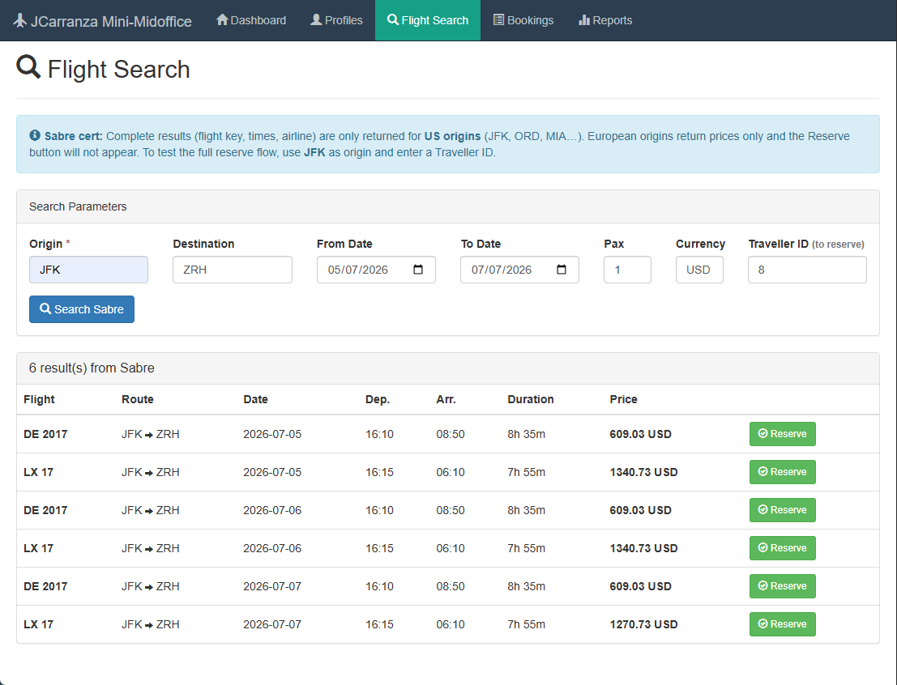
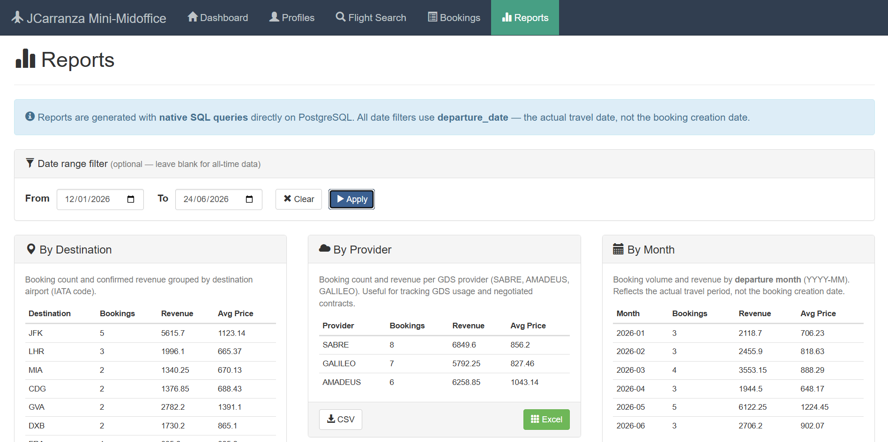

# JCarranza Mini-Midoffice

> A travel-agency mid-office system — and a hands-on record of migrating it from **Spring 5.3 → 6.1 / Hibernate 5.6 → 6.4 / Tomcat 9 → 10.1**, commit by commit, every step compiling green.

---

## Spring 5→6 / Hibernate 5→6 Migration

| | v1.0 — before | v2.0 — after |
|---|---|---|
| Spring Framework | 5.3.39 | 6.1.14 |
| Hibernate ORM | 5.6.15.Final | 6.4.4.Final |
| Servlet container | Tomcat 9 | Tomcat 10.1 |
| Namespace | `javax.*` | `jakarta.*` |
| Transaction manager | `HibernateTransactionManager` | `JpaTransactionManager` |

Steps 0–4 were committed as isolated, always-green changesets. Ten gotchas are documented in [`docs/10-migration-spring6.md`](docs/10-migration-spring6.md) — including the non-obvious ones: Spring 6 ships no `hibernate6` ORM package (forcing the full JPA-based config), the `-parameters` compiler flag requirement, and why the transaction manager change is behaviourally equivalent for this codebase.

[Full migration write-up →](docs/10-migration-spring6.md) · [v1.0 → v2.0 diff →](https://github.com/carranza-javier/mini-midoffice/compare/v1.0-spring5-hibernate5...v2.0-spring6-hibernate6)

> This is a technical exercise documenting how the migration is approached and recorded — not a recommendation about what any production system should do.

---

## Sabre GDS Integration



Live integration with the Sabre certification sandbox: OAuth2 client-credentials, flight search (`POST /v1/offers/flightSearch`), real-time FlightCheck price verification (`POST /v1/offers/flightCheck`), and booking reserve. Behind a port/adapter anti-corruption layer — the `GdsFlightSearchPort` and `GdsFlightCheckPort` interfaces mean Sabre can be swapped for Amadeus or Galileo without touching the service layer.

---

## What It Demonstrates

- **Maven multi-module WAR** — five modules (domain / integration / persistence / service / web), no Spring Boot
- **Explicit two-context Spring setup** — Root context (services, DAOs, Hibernate) separate from Web context (controllers), required for `@Transactional` to intercept at the service boundary
- **Transactional booking flow** — `PROPAGATION_REQUIRES_NEW` wraps the external GDS FlightCheck call inside its own transaction; SEQUENCE IDs assigned at `persist()` before flush
- **Native-SQL reporting** with CSV / Excel export (Apache POI) and date-range filters



- **Logback observability** — per-request MDC `requestId`, three named log files routing to business / Sabre-integration / errors

---

## Stack

Java 17 · Spring 6.1.14 · Hibernate 6.4.4.Final · PostgreSQL 16 · HikariCP · Tomcat 10.1 · Maven multi-module WAR · Jackson · Apache POI · Logback · Bootstrap 3 / jQuery / Handlebars

---

## Run It

Requires Docker. See [`HOW-TO-RUN.md`](HOW-TO-RUN.md) for the full API reference.

```powershell
# 1 — PostgreSQL
docker run -d --name mini-midoffice-db -p 5432:5432 `
  -e POSTGRES_PASSWORD=miniumbrella -e POSTGRES_DB=miniumbrella `
  postgres:16

# 2 — Build  (adjust volume path to your checkout location)
docker run --rm `
  -v "C:/workspace/mini-midoffice:/workspace" `
  -v "$env:USERPROFILE/.m2:/root/.m2" `
  -w /workspace `
  maven:3.9.6-eclipse-temurin-17 `
  mvn clean package -DskipTests --no-transfer-progress

# 3 — Run
docker run -d --name mini-midoffice-app -p 8080:8080 `
  -e JAVA_OPTS="-Ddb.url=jdbc:postgresql://host.docker.internal:5432/miniumbrella -Ddb.username=postgres -Ddb.password=miniumbrella" `
  -v "C:/workspace/mini-midoffice/mini-midoffice-web/target/mini-midoffice-web-1.0.0-SNAPSHOT.war:/usr/local/tomcat/webapps/ROOT.war:ro" `
  tomcat:10.1-jdk17
```

App at `http://localhost:8080` · API at `http://localhost:8080/api/`

---

## Project Structure

```
mini-midoffice/
├── mini-midoffice-domain/        JPA entities, enums, domain exceptions
├── mini-midoffice-integration/   Sabre GDS adapters, OAuth2, HTTP client
├── mini-midoffice-persistence/   Hibernate DAOs, JDBC reporting, schema SQL
├── mini-midoffice-service/       Business logic, BookingServiceImpl (TransactionTemplate)
└── mini-midoffice-web/           Spring MVC controllers, filters, SPA, web.xml
```
